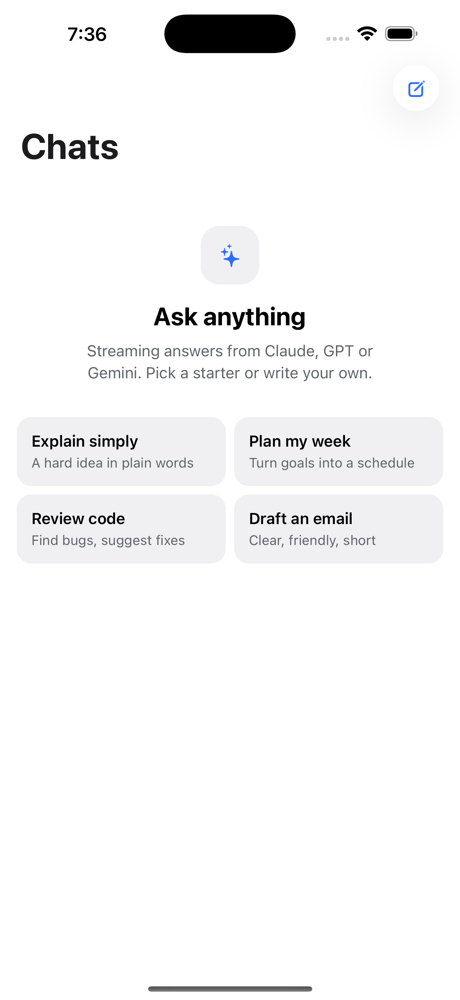
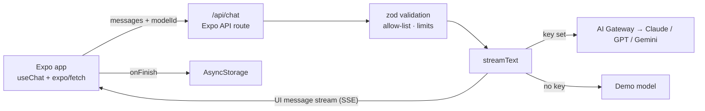

# Expo AI Assistant

**A streaming, multi-model AI chat app for iOS, Android and web, built with one Expo codebase.** Claude, GPT and Gemini are behind a single server route that keeps your API key off the device.

[](https://github.com/OwaisMunawar/expo-ai-assistant/actions/workflows/ci.yml)


[](LICENSE)

<p align="center">
  
</p>

## Why

Most "AI chat in React Native" examples call the provider straight from the app with a key baked into the bundle, and stop at a single `Text` component. This one is closer to what ships:

- **The key stays on the server.** An [Expo API route](https://docs.expo.dev/router/web/api-routes/) holds it, validates every request and streams the reply back.
- **It streams on native, not just web.** `expo/fetch`, plus the right polyfills for Hermes.
- **It runs with zero setup.** Without a key, a demo model streams through the same pipeline, so you can clone, run and review it in two minutes.

## Features

- **Streaming chat** with stop and regenerate, using the [AI SDK](https://ai-sdk.dev) `useChat` hook
- **Model switching** per conversation between Claude Sonnet 5.5, GPT-5.5 and Gemini 3.5 Flash, through the Vercel AI Gateway
- **Markdown replies** with headings, lists, inline styles and code blocks with a copy button, rendered correctly while the reply is still streaming
- **Read aloud** with the device speech engine (`expo-speech`)
- **Local history.** Conversations are saved on the device, titled automatically, and can be deleted with a long press.
- **Starter prompts** on the empty state
- **Light and dark mode**, safe areas, keyboard-aware composer and accessibility labels on every control
- **Server hardening:** a model allow-list, no system messages accepted from the client, size limits, masked provider errors and request cancellation

## Architecture



The code is organised by feature (`src/features/chat`, `src/features/conversations`), with server-only code in `src/server`. A lint rule blocks client code from importing server modules. The key decisions and the alternatives I rejected are written up in **[docs/ARCHITECTURE.md](docs/ARCHITECTURE.md)**.

## Tech stack

| Area | Choice |
| --- | --- |
| App | Expo SDK 57, React Native 0.86, React 19, Expo Router (typed routes), React Compiler |
| AI | AI SDK v7 (`ai`, `@ai-sdk/react`), Vercel AI Gateway |
| Server | Expo API routes, deployable with EAS Hosting |
| Validation | zod |
| Storage | AsyncStorage with `useSyncExternalStore` |
| Native APIs | `expo-speech`, `expo-clipboard`, `expo-haptics`, `expo-symbols` (SF Symbols / Material Symbols) |
| Quality | TypeScript strict, ESLint, Prettier, Jest (`jest-expo`), Maestro, GitHub Actions, Dependabot |

## Quick start

```bash
git clone https://github.com/OwaisMunawar/expo-ai-assistant && cd expo-ai-assistant
npm install
npm run web        # or: npm run ios / npm run android
```

This runs in **demo mode**. For real answers, copy `.env.example` to `.env.local`, add an [AI Gateway](https://vercel.com/ai-gateway) key and restart.

### Deploying

```bash
npx expo export --platform web && npx eas-cli@latest deploy   # API routes + web app
npx eas-cli@latest build --profile preview                     # iOS / Android builds
```

Set `AI_GATEWAY_API_KEY` in the EAS Hosting environment. Native builds read the deployed URL from `EXPO_PUBLIC_API_BASE_URL`, which is set per profile in `eas.json`.

## Quality

| Check | Command |
| --- | --- |
| Format | `npm run format:check` |
| Lint, including the client/server import boundary | `npm run lint` |
| Types (strict, `noUncheckedIndexedAccess`) | `npm run typecheck` |
| Unit tests with coverage thresholds | `npm test -- --coverage` |
| Dependency health | `npx expo-doctor` |
| End-to-end (dev build, demo mode) | `npm run e2e` |

CI runs every check except end-to-end on each push, then exports the web app and API routes.

The unit tests cover request validation and limits, the streaming handler end to end (through the real AI SDK stream protocol), the markdown parser's partial-stream states, conversation titling and previews, and API URL resolution per platform.

## Roadmap

- [ ] Voice input (speech-to-text) through a dev-build module
- [ ] Image attachments for vision models
- [ ] On-device fallback model (llama.rn or ExecuTorch) for offline use
- [ ] Sign-in and synced history with Supabase
- [ ] Subscriptions with RevenueCat
- [ ] Per-user rate limiting on the API route
- [ ] Maestro run on EAS Workflows in CI

## License

MIT © 2026 Owais Munawwar

---

Built by [Owais Munawwar](https://github.com/OwaisMunawar). I'm available for React Native, AI and iOS work on [Upwork](https://www.upwork.com/freelancers/owaism11).
