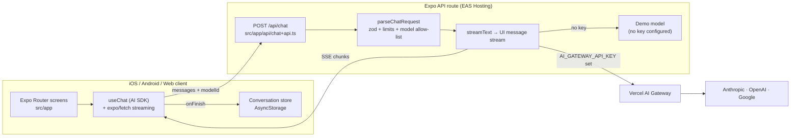

# Architecture

This document explains how the app is put together and why. It is written for reviewers and for anyone extending the app.

## Overview



## Folder layout

```
src/
  app/                 Routes only (Expo Router). Screens compose features.
    api/chat+api.ts    Server route: 3 lines, delegates to src/server.
  features/
    chat/              Chat UI: composer, message rows, markdown, model picker.
    conversations/     Conversation model (pure functions) + persisted store.
  server/              Server-only code. Never imported by client code (lint-enforced).
  shared/              Code safe for both sides: model catalog, limits, prompts.
  theme/  ui/          Design tokens, color-scheme hooks, icon primitive.
```

Code is grouped by feature, not by file type, so a feature can be read, changed or deleted in one place. `src/app` stays thin: a screen wires hooks and components together and holds no business logic.

## Decisions

### 1. The API key lives on a server route, never in the app

Anything shipped in a mobile binary can be extracted. The client sends messages and a model ID to `/api/chat`; the route holds `AI_GATEWAY_API_KEY`. Expo API routes let the server live in the same repo and deploy with `eas deploy`, so there is no separate backend to maintain.

_Rejected:_ calling providers directly from the app with a key in `EXPO_PUBLIC_*`. That is simple but leaks the key to anyone who unzips the IPA or APK.

### 2. One gateway key instead of one key per provider

Model IDs are gateway IDs (`anthropic/claude-sonnet-5.5`). Adding a provider is a one-line change to `src/shared/models.ts`, and billing and rate limits are in one place.

_Rejected:_ wiring `@ai-sdk/openai`, `@ai-sdk/anthropic` and `@ai-sdk/google` separately. That is more configuration and more secrets, for no user-facing benefit. It is easy to switch back: `streamText` takes any `LanguageModel`.

### 3. The server does not trust the client

`parseChatRequest` validates the body with zod and enforces:

- **Model allow-list.** The client picks from `MODELS`; unknown IDs are a 400, so nobody can point your key at an expensive model.
- **No client system messages.** The server owns the system prompt, which blocks the simplest prompt-injection route.
- **Size limits.** Message count, characters per message and output tokens are capped (`src/shared/limits.ts`). The same limits cap the input on the client, so users see the rule before the server enforces it.
- **Masked errors.** Provider errors are replaced with a generic message, so stack traces and upstream details never reach the device.

The handler is a plain `(Request, env) => Response` function, so it is unit-tested without an Expo runtime and could be moved to any Fetch-API server unchanged.

### 4. Demo mode runs the real pipeline

With no key set, the route swaps in a mock language model that streams a canned reply. The request still goes through validation, `streamText`, the UI message stream protocol, `useChat`, rendering and persistence. A reviewer can clone and run the app with zero setup, and the tests exercise the same code path as production.

### 5. Streaming on native uses `expo/fetch`

React Native's built-in `fetch` buffers the whole response. `expo/fetch` exposes a `ReadableStream`, and `src/polyfills.ts` adds the `TextDecoderStream` and `structuredClone` globals the AI SDK needs on Hermes.

### 6. Local-first persistence with a small external store

Conversations are saved to AsyncStorage under a single versioned key (`conversations:v1`). React reads them through `useSyncExternalStore`, which keeps renders consistent without a state library. The dataset is text only and small, so a single key keeps writes atomic and migrations trivial.

_Rejected:_ SQLite. It's worth it once there is search or pagination (see the roadmap), but not before. Also rejected: Zustand or Redux, because one store with three operations doesn't need a library.

### 7. A small, stream-tolerant markdown renderer

LLM output is mostly paragraphs, lists and code. `src/features/chat/lib/markdown.ts` handles exactly that and treats an unclosed code fence as code, which is the normal state mid-stream. It is pure and fully unit-tested. The general-purpose version lives in its own package, [react-native-streaming-markdown](https://github.com/OwaisMunawar/react-native-streaming-markdown).

## Quality gates

| Gate                       | Tool                                                                                                      | Where                |
| -------------------------- | --------------------------------------------------------------------------------------------------------- | -------------------- |
| Formatting                 | Prettier                                                                                                  | CI `format:check`    |
| Lint and import boundaries | ESLint (`eslint-config-expo`) plus a `no-restricted-imports` rule that blocks `@/server/*` in client code | CI `lint`            |
| Types                      | TypeScript strict with `noUncheckedIndexedAccess`                                                         | CI `typecheck`       |
| Unit tests                 | Jest (`jest-expo`) with coverage thresholds of 90% lines                                                  | CI `test --coverage` |
| Dependencies               | `expo-doctor`, Dependabot (grouped Expo and AI SDK updates)                                               | CI, weekly           |
| Web and server bundle      | `expo export --platform web`                                                                              | CI                   |
| End to end                 | Maestro flow in `.maestro/`, run against a dev build                                                      | Local / EAS          |
